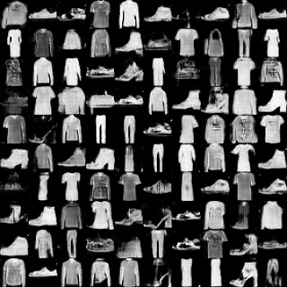
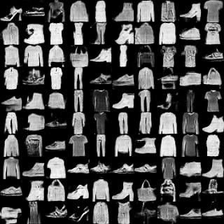
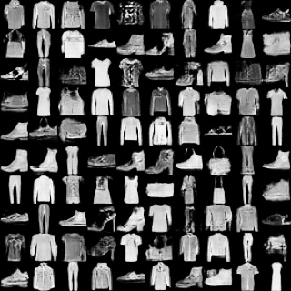
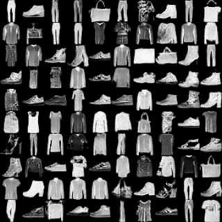
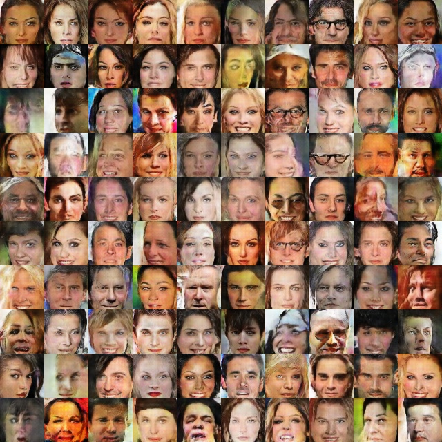
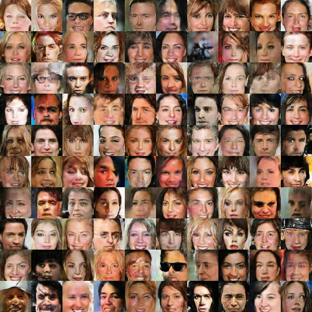
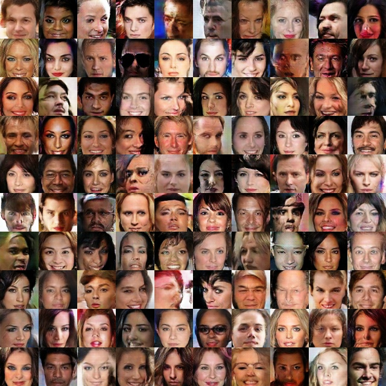
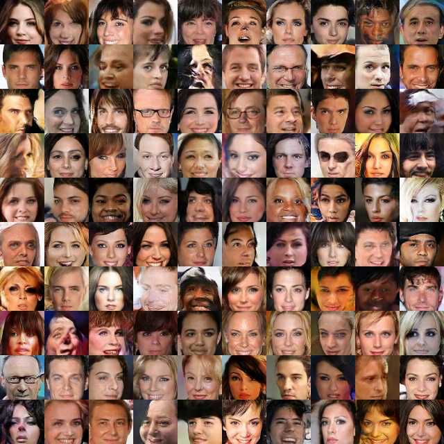
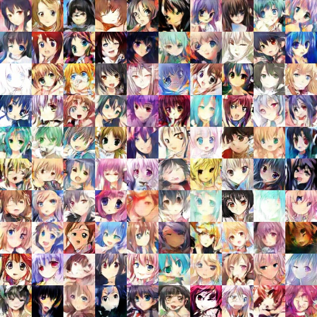
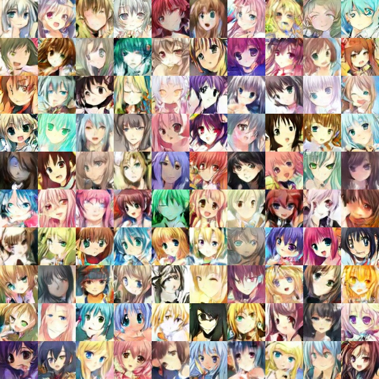

***Recommendation***

- Our GAN based work for facial attribute editing - [AttGAN](https://github.com/LynnHo/AttGAN-Tensorflow).

***New***

- 8 April 2019: We re-implement these GANs by **Tensorflow 2**! The old version is here: [v1](https://github.com/LynnHo/DCGAN-LSGAN-WGAN-WGAN-GP-Tensorflow/tree/v1) or in the "v1" directory.
- [**PyTorch** Version](https://github.com/LynnHo/DCGAN-LSGAN-WGAN-GP-DRAGAN-Pytorch)

<hr style="height:1px" />

<p align="center">
      
</p>

<hr style="height:1px" />

# <p align="center"> GANs - Tensorflow 2 </p>

Tensorflow 2 implementations of [DCGAN](https://arxiv.org/abs/1511.06434), [LSGAN](https://arxiv.org/abs/1611.04076), [WGAN-GP](http://arxiv.org/abs/1704.00028) and [DRAGAN](https://arxiv.org/abs/1705.07215v5).

## Exemplar results

### Fashion-MNIST

DCGAN                                    | LSGAN                                      | WGAN-GP                                      | DRAGAN
:---:                                    | :---:                                      | :---:                                        | :---:
 |  |  | 

### CelebA

DCGAN                                 | LSGAN
:---:                                 | :---:
     | 
**WGAN-GP**                           | **DRAGAN**
 | 

### Anime

**WGAN-GP**                          | **DRAGAN**
:---:                                | :---:
 | 

# Usage

- Environment

    - Python 3.6

    - TensorFlow 2.2, TensorFlow Addons 0.10.0

    - OpenCV, scikit-image, tqdm, oyaml

    - *we recommend [Anaconda](https://www.anaconda.com/distribution/#download-section) or [Miniconda](https://docs.conda.io/en/latest/miniconda.html#linux-installers), then you can create the AttGAN environment with commands below*

        ```console
        conda create -n tensorflow-2.2 python=3.6

        source activate tensorflow-2.2

        conda install -c anaconda scikit-image

        conda install -c anaconda tqdm

        conda install -c conda-forge oyaml

        conda install -c anaconda tensorflow-gpu=2.2

        pip install tensorflow-addons==0.10.0
        ```

- Datasets

    - Fashion-MNIST will be automatically downloaded
    - CelebA should be prepared by yourself in **./data/img_align_celeba/\*.jpg**
        - dataset link: [Dropbox](https://www.dropbox.com/sh/8oqt9vytwxb3s4r/AAB06FXaQRUNtjW9ntaoPGvCa?dl=0)
        - the above link might be inaccessible, the alternatives are (find "img_align_celeba.zip")
            - [Baidu Netdisk](https://pan.baidu.com/s/1eSNpdRG#list/path=%2Fsharelink2785600790-938296576863897%2FCelebA%2FImg&parentPath=%2Fsharelink2785600790-938296576863897) or
            - [Google Drive](https://drive.google.com/drive/folders/0B7EVK8r0v71pTUZsaXdaSnZBZzg)
    - the Anime dataset should be prepared by yourself in **./data/faces/\*.jpg**
        - dataset link: https://pan.baidu.com/s/1eSifHcA, password: g5qa
        - reference: https://zhuanlan.zhihu.com/p/24767059

- Examples of training

    - Fashion-MNIST DCGAN

        ```console
        CUDA_VISIBLE_DEVICES=0 python train.py --dataset=fashion_mnist --epoch=25 --adversarial_loss_mode=gan
        ```

    - CelebA DRAGAN

        ```console
        CUDA_VISIBLE_DEVICES=0 python train.py --dataset=celeba --epoch=25 --adversarial_loss_mode=gan --gradient_penalty_mode=dragan
        ```

    - Anime WGAN-GP

        ```console
        CUDA_VISIBLE_DEVICES=0 python train.py --dataset=anime --epoch=200 --adversarial_loss_mode=wgan --gradient_penalty_mode=wgan-gp --n_d=5
        ```

    - see more training exampls in [commands.sh](./commands.sh)

    - tensorboard for loss visualization

        ```console
        tensorboard --logdir ./output/fashion_mnist_gan/summaries --port 6006
        ```

