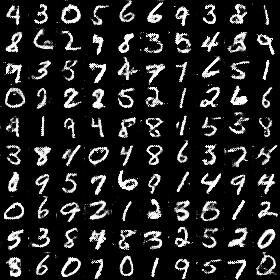

# GANs

Tensorflow implementation of DCGAN, LSGAN, WGAN and WGAN-GP, and we use DCGAN as the network architecture in all experiments.

DCGAN: [Unsupervised representation learning with deep convolutional generative adversarial networks](https://arxiv.org/abs/1511.06434) 

LSGAN: [Least squares generative adversarial networks](https://pdfs.semanticscholar.org/0bbc/35bdbd643fb520ce349bdd486ef2c490f1fc.pdf)

WGAN: [Wasserstein GAN](https://arxiv.org/abs/1701.07875)

WGAN-GP: [Improved Training of Wasserstein GANs](http://arxiv.org/abs/1704.00028)

## Exemplar results

### mnist 
DCGAN - LSGAN

 

WGAN - WGAN-GP

 

### celeba

# Prerequisites
- tensorflow r1.2
- python 2.7

# Usage

## Train
```
python train_mnist_dcgan.py
python train_celeba_dcgan.py
...
```
## Tensorboard
```
tensorboard --logdir=./summaries/celeba_wgan --port=6006
...
```

## Datasets
1. mnist will be automatically downloaded
2. celeba should be prepared by yourself in ./data/img_align_celeba