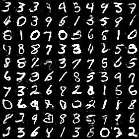
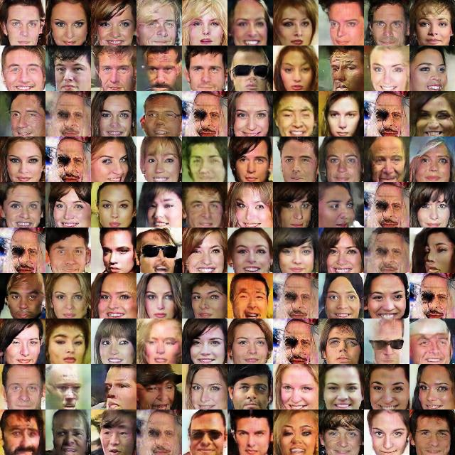
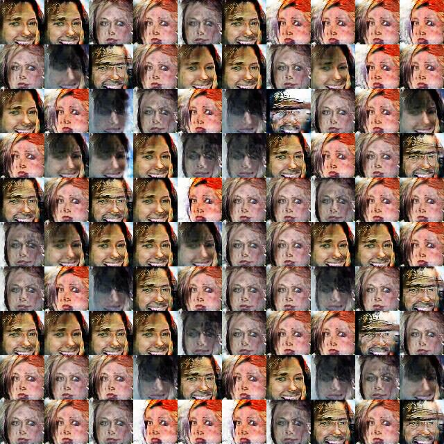
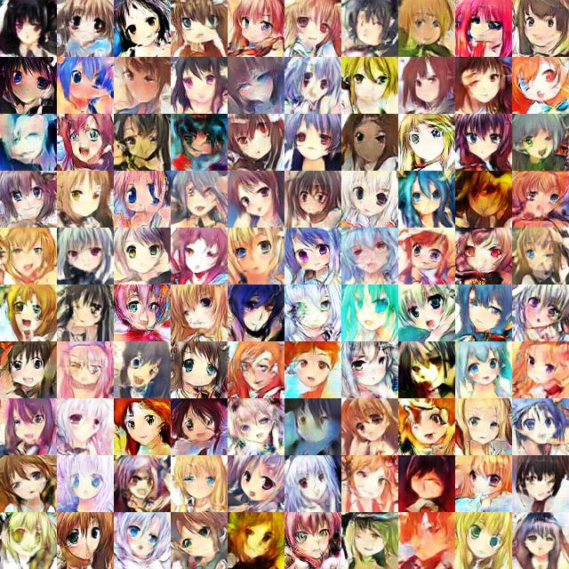

***Recommendation***

- Our GAN based work for facial attribute editing - https://github.com/LynnHo/AttGAN-Tensorflow.

---

# GANs

Tensorflow implementation of DCGAN, LSGAN, WGAN and WGAN-GP, and we use DCGAN as the network architecture in all experiments.

DCGAN: [Unsupervised representation learning with deep convolutional generative adversarial networks](https://arxiv.org/abs/1511.06434)

LSGAN: [Least squares generative adversarial networks](https://pdfs.semanticscholar.org/0bbc/35bdbd643fb520ce349bdd486ef2c490f1fc.pdf)

WGAN: [Wasserstein GAN](https://arxiv.org/abs/1701.07875)

WGAN-GP: [Improved Training of Wasserstein GANs](http://arxiv.org/abs/1704.00028)

## Exemplar results

### Mnist - 50 epoch
DCGAN - LSGAN

 

WGAN - WGAN-GP

 

### Celeba
DCGAN (left: 25 epoch, right: 50 epoch (slight mode collapse))

 

LSGAN (left: 25 epoch, right: 50 epoch (heavy mode collapse))

 

left: WGAN 50 epoch, right: WGAN-GP 50 epoch

 

### Cartoon
left: WGAN 100 epoch, right: WGAN-GP 100 epoch

 

# Prerequisites
- tensorflow r1.2
- python 2.7

# Usage

## Train
```
python train_mnist_dcgan.py
python train_celeba_wgan.py
python train_cartoon_wgan_gp.py
...
```
## Tensorboard
```
tensorboard --logdir=./summaries/celeba_wgan --port=6006
...
```

## Datasets
1. Mnist will be automatically downloaded
2. Celeba should be prepared by yourself in ./data/img_align_celeba/*.jpg
    - Download the dataset: https://www.dropbox.com/sh/8oqt9vytwxb3s4r/AAB06FXaQRUNtjW9ntaoPGvCa?dl=0
    - the above links might be inaccessible, the alternative is
        - ***img_align_celeba.zip***
            - https://pan.baidu.com/s/1eSNpdRG#list/path=%2FCelebA%2FImg or
            - https://drive.google.com/drive/folders/0B7EVK8r0v71pTUZsaXdaSnZBZzg
3. The cartoon-face dataset should be prepared by yourself in ./data/faces
    - Download the dataset: https://pan.baidu.com/s/1eSifHcA, password: g5qa
    - Reference: https://zhuanlan.zhihu.com/p/24767059